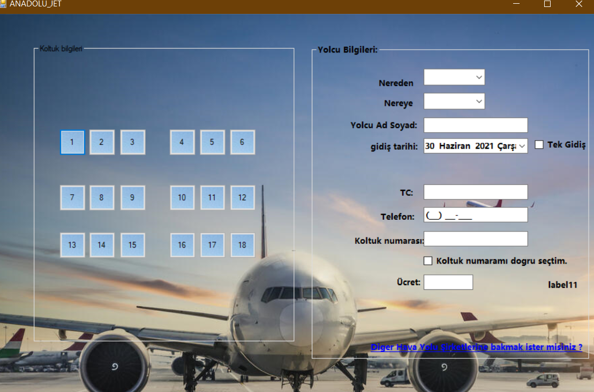
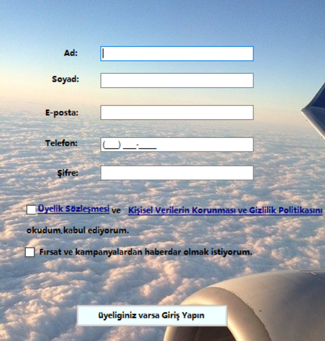
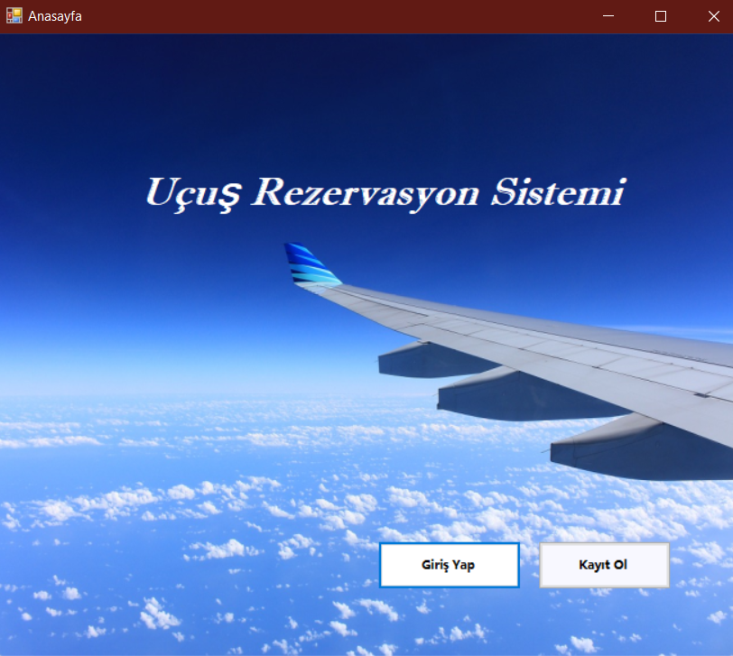

# ucus_rezervasyon
# ✈️ Uçuş Rezervasyon Sistemi

Bu proje, **C# Windows Form** kullanılarak geliştirilmiş bir **Uçuş Rezervasyon Sistemi**dir. Sistem, kullanıcıların uçuş rezervasyonlarını kolayca yapmasını sağlayan bir arayüz sunar. Kullanıcılar, uçuş detaylarını seçebilir, rezervasyonlarını görüntüleyebilir ve yönetebilir.

---

## 📂 Proje Özellikleri

- 🛫 **Uçuş Bilgileri Seçimi**:
  - Kalkış ve varış şehirlerini seçme.
  - Tarih ve saat ayarlama.
  
- 📝 **Rezervasyon İşlemleri**:
  - Kullanıcı bilgilerini girerek uçuş rezervasyonu yapma.
  - Rezervasyon detaylarını görüntüleme.
  
- 🧾 **Bilet Yönetimi**:
  - Bilet bilgilerini kaydetme ve listeleme.
  - Rezervasyon iptal etme seçeneği.

---

## 🛠️ Teknolojiler

Bu proje aşağıdaki teknolojilerle geliştirilmiştir:

- **C#**: Projenin temel programlama dili.
- **Windows Forms**: Uygulama arayüzü için kullanılmıştır.


---

## 🚀 Nasıl Çalıştırılır?

1. **Projeyi İndirin veya Klonlayın:**
   ```bash
   git clone <repository-url>


  



